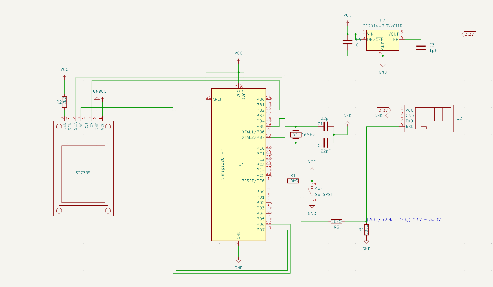

# Bluetooth Led Controller Project

# Schematics

# Datasheets
ATMEGA328P - https://ww1.microchip.com/downloads/en/DeviceDoc/Atmel-7810-Automotive-Microcontrollers-ATmega328P_Datasheet.pdf

ST7735 - https://www.displayfuture.com/Display/datasheet/controller/ST7735.pdf

HM-10 Bluetooth Module - https://people.ece.cornell.edu/land/courses/ece4760/PIC32/uart/HM10/DSD%20TECH%20HM-10%20datasheet.pdf

AVRISPMKII Programmer - https://ww1.microchip.com/downloads/en/DeviceDoc/Atmel-42093-AVR-ISP-mkII_UserGuide.pdf

How to program the ATMEGA328P using the AVRISPMKII Programmer - https://www.ee-diary.com/2021/06/how-to-program-atmega328p-using-atmel.html
